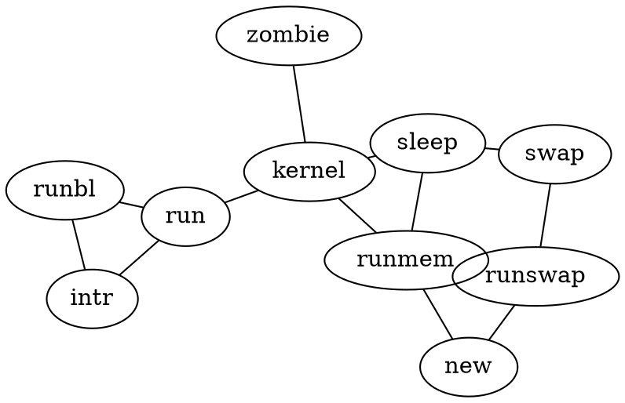

# Markdown Files

Whether you write your book's content in Jupyter Notebooks (`.ipynb`) or
in regular markdown files (`.md`), you'll write in the same flavor of markdown
called **MyST Markdown**.
This is a simple file to help you get started and show off some syntax.

## What is MyST?

MyST stands for "Markedly Structured Text". It
is a slight variation on a flavor of markdown called "CommonMark" markdown,
with small syntax extensions to allow you to write **roles** and **directives**
in the Sphinx ecosystem.

For more about MyST, see [the MyST Markdown Overview](https://jupyterbook.org/content/myst.html).

## Sample Roles and Directives

Roles and directives are two of the most powerful tools in Jupyter Book. They
are kind of like functions, but written in a markup language. They both
serve a similar purpose, but **roles are written in one line**, whereas
**directives span many lines**. They both accept different kinds of inputs,
and what they do with those inputs depends on the specific role or directive
that is being called.

Here is a "note" directive:

```{note}
Here is a note
```

It will be rendered in a special box when you build your book.

Here is an inline directive to refer to a document in this section
`` {doc}`citations` `` wich renders as {doc}`citations`. We can also use `../`
to navigate to parent sections like `` {doc}`../interactive-server/index` ``.

## Diagrams


### Mermaid flowchart

```{warning}
At this moment, Mermaid is not working in this Jupyter Book.
```

We have installed an extension to draw diagrams from text using `Mermaid`. The
following is an example of the code necessary to generate the diagram below.

```{mermaid}
flowchart TD
  A[square node A] --> B(round edges node B)
  A --> C([stadium node C])
  B --> D[[subroutine node D]]
  B --> E[(database node E)]
  B --> F((circle F))
  C --> F
```

```{warning}
  I have removed the directive {mermaid} in the following examples to avoid
  warnings
```

```
flowchart TD
  A[square node A] --> B(round edges node B)
  A --> C([stadium node C])
  B --> D[[subroutine node D]]
  B --> E[(database node E)]
  B --> F((circle F))
  C --> F
```

```
graph LR;
    A-->B;
    A-->C;
    B-->D;
    C-->D;
```

```
sequenceDiagram
	participant Alice
	participant Bob
	Alice->John: Hello John, how are you?
```

```
sequenceDiagram
	participant Alice
	participant Bob
	Alice->John: Hello John, how are you?
	loop Healthcheck
			John->John: Fight against hypochondria
	end
	Note right of John: Rational thoughts <br/>prevail...
	John-->Alice: Great!
	John->Bob: How about you?
	Bob-->John: Jolly good!
```

```
graph TD
A[Client] -->|tcp_123| B(Load Balancer)
B -->|tcp_456| C[Server1] 
B -->|tcp_456| D[Server2]
```


You can find the basic syntax for flowcharts at
[mermaid](https://mermaid.js.org/syntax/flowchart.html).

It is possible to add other diagram plugin extensions. See other options in
[sphinx-diagrammers](https://opencomputinglab.github.io/SubjectMatterNotebooks/diagram/sphinx-diagrammers.html).

### Mermaid Mindmaps

With [Mermaid](https://mermaid.js.org/intro/) it is possible to generate other
types of diagrams, the following is an example for a
[mindmap](https://mermaid.js.org/syntax/mindmap.html).

```

mindmap
  root((Data Science))
    Statistics
      Surveys
      Experiments
    Scientific Computing
    Scientific Methods
      Hypothesis Testing
      Evaluation
    Processes
      Parallel Programming
      Crawlers
    Algorithms
    Systems
      High Performance Computing
      Personal Computers
      Distributed Computing
```

### Tikz

```{tikz}
\draw[thick,rounded corners=8pt]
   (0,0)--(0,2)--(1,3.25)--(2,2)--(2,0)--(0,2)--(2,2)--(0,0)--(2,0);
```

```{tikz}
\node[blue,draw] (a) {A};
\node[draw,dotted,right of=a] {B} edge[<-] (a);
```


```{tikz} 
mindmap, grow cyclic, every node/.style=concept, concept color=orange!40

\node{ShareLaTeX Tutorial Videos}
 child { node {Beginners Series}
 child { node {First Document}}
 child { node {Sections and Paragraphs}}
 child { node {Mathematics}}
 child { node {Images}}
 child { node {bibliography}}
 child { node {Tables and Matrices}}
 child { node {Longer Documents}}
}
child { node {Thesis Series}
 child { node {Basic Structure}}
 child { node {Page Layout}}
 child { node {Figures, Subfigures and Tables}}
 child { node {Biblatex}}
 child { node {Title Page}}
}
child { node {Beamer Series}
 child { node {Getting Started}}
 child { node {Text, Pictures and Tables}}
 child { node {Blocks, Code and Hyperlinks}}
 child { node {Overlay Specifications}}
 child { node {Themes and Handouts}}
}
child { node {TikZ Series}
 child { node {Basic Drawing}}
 child { node {Geogebra}}
 child { node {Flow Charts}}
 child { node {Circuit Diagrams}}
 child { node {Mind Maps}}
};
```

### Graphviz

```{warning}
At this moment, Graphviz is not working in this Jupyter Book.
```



### UML

```{warning}
At this moment, UML is not working in this Jupyter Book. I removed the
directive {uml} to avoid compilation Warnings.
```

````
```{uml}
Alice -> Bob: Authentication Request
Bob --> Alice: Authentication Response

Alice -> Bob: Another authentication Request
Alice <-- Bob: Another authentication Response
```
````

### Wavedrom

```{wavedrom}
{ signal : [
  { name: "clk",  wave: "p......" },
  { name: "bus",  wave: "x.34.5x",   data: "head body tail" },
  { name: "wire", wave: "0.1..0." },
]}
```

### Blockdiag

```{blockdiag}
A -> B;
```

## Cross-references

{ref}`figure-example-1`


```{figure} images/example.svg
:name: figure-example-1

Caption of the example figure ex1
```

{ref}`table-example-1`

```{table} Caption of the table ex1
:name: table-example-1
| header 1 | header 2 |
| -------- | -------- |
|    a     |    b     |
```

This is a reference to Equation {eq}`equation-example-1`

```{math}
:label: equation-example-1

E = mc^2
```

## Videos

We can insert videos in the middle of a markdown file by using `html` and and
`iframe` like the following example

```html
<iframe width="560" height="315"
src="https://www.youtube.com/embed/4kwEMHZJx5A" title="YouTube video player"
frameborder="0" allow="accelerometer; autoplay; clipboard-write;
encrypted-media; gyroscope; picture-in-picture; web-share"
allowfullscreen></iframe>
```

which renders the following video

<iframe width="560" height="315"
src="https://www.youtube.com/embed/4kwEMHZJx5A" title="YouTube video player"
frameborder="0" allow="accelerometer; autoplay; clipboard-write;
encrypted-media; gyroscope; picture-in-picture; web-share"
allowfullscreen></iframe>

## Inline-tabs

First two tabs showing off defining a function.

````{tab} Python
```python
def main():
    return
```
````
````{tab} C++
```c++
int main(const int argc, const char **argv) {
  return 0;
}
```
````

Second two tabs showing off printing.

````{tab} Python
```python
print("Hello World!")
```
````

````{tab} C++
```c++
#include <iostream>

int main() {
  std::cout << "Hello World!" << std::endl;
}
```
````

## Learn more

This is just a simple starter to get you started.
You can learn a lot more at [jupyterbook.org](https://jupyterbook.org).


