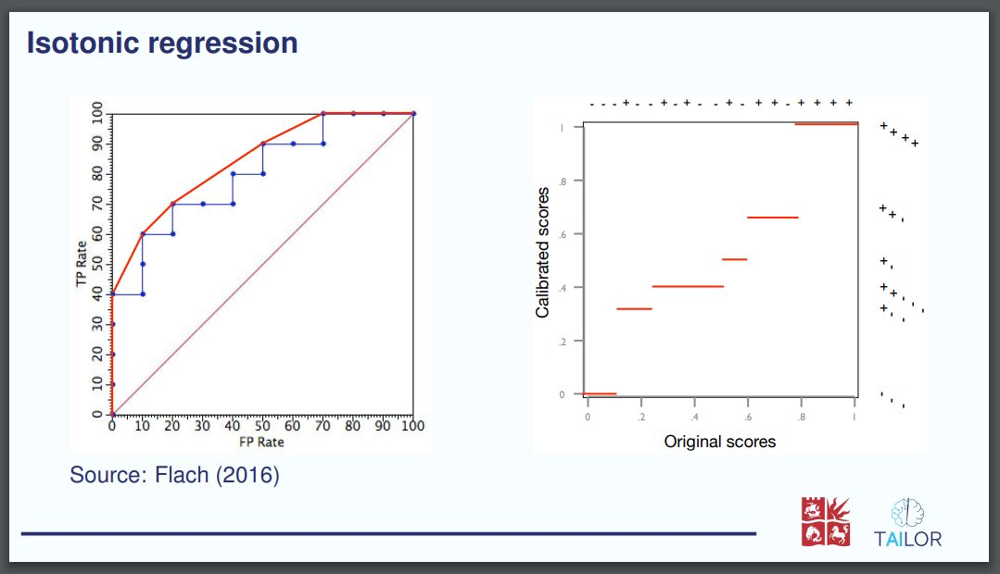
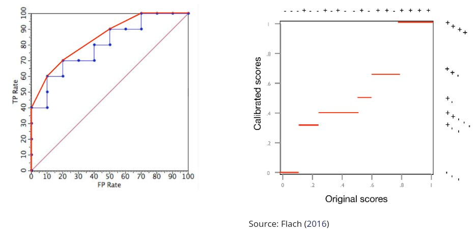
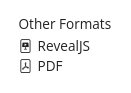

---
jupytext:
  formats: md:myst
  text_representation:
    extension: .md
    format_name: myst
    format_version: 0.13
    jupytext_version: 1.10.3
kernelspec:
  display_name: Python 3
  language: python
  name: python3
---

(sec:use:lat)=
# Convert a LaTeX Beamer presentation to Quarto

In this use case we start from an already existing set of
slides made with LaTeX package [Beamer](https://ctan.org/pkg/beamer?lang=en).
The course generated in this use case is available at
https://tailor-uob.github.io/mooc_trustworthy_ai/cha_wahcc/wahcc.html.

This use case explains the process followed to generate the `Quarto` course
material. In order to replicate the steps involved you can {download}`download
the presentation source files from this link <./data/cla-cal-slides.zip>`. 

To generate the slides first unzip the downloaded file and run `pdflatex` and
`biber` as follows

```shell
unzip -X cla_cal_slides.zip
pdflatex main.tex
biber main
pdflatex main.tex
```

The rest of this section uses the content of the zip file to extend the `Quarto`
project started in the use case [](sec:use:qua).

## Pandoc: from LaTeX to markdown

Depending on the size of the LaTeX project it may be possible to manually
copy the main content and edit it in such a form that is markdown compliant.
This may be a good solution as at the end there is no perfect automation to
convert LaTeX to markdown. However, there are a few alternatives that will do
part of the job automatically. In particular, `pandoc` is a tool to convert text
documents into a multitude of other formats (see [](sec:pandoc)).  
The command to convert a LaTeX file to `markdown` is the following.

```shell
pandoc main.tex -s -o main.md
```
However, this will result in a markdown with only the titles of the sections
and empty content. This is because the LaTeX source code of this example
contains several definitions and new commands that can not be converted by
`pandoc` without manual modifications.

The first thing that needed to be changed was to define the command
`brightFrame` which was previously defined in a separate file that contained
lots of other definitions and commands. Remove the line 44 that loads the
external file `frame-commands.tex`.

```latex
44: \input{latex/frame-commands}
```

And define the new command `brigthFrame` in the `main.tex` file

```latex
\newcommand{\brightFrame}[2]{
  \begin{frame}
    \frametitle{#1}
    #2
  \end{frame}
}
```

Only with this change the resulting `markdown` file will contain most of the
original information including tables, some figures, equations, and references.
The resulting markdown file needs to be renamed to include the Quarto extension
`.qmd`, and it can be copied to a Quarto project together with the figures
folder, bibliography and other documents. The next image shows the header of
the resulting markdown content rendered into html.

```{figure} images/pandoc_1.jpg
---
width: 100 %
align: center
alt: Website with right navigation bar and central content
---

Begining of the markdown document converted by Pandoc and rendered by Quarto.
```

Some of the figures that are originally in the pdf format are rendered inside
of a pdf reader interface. This will need to be fixed manually by converting
the pdfs into images.

```{figure} images/pandoc_2.jpg
---
width: 80 %
align: center
alt: A figure inside a pdf environment
---

PDF figures in the markdown file rendered by Quarto.
```

Equations in LaTeX are kept in their original form in the generated markdown
files as pandoc will convert the equations to
[MathJax](https://www.mathjax.org/) which is a JavaScript display engine for
mathematics.

```{figure} images/pandoc_4.jpg
---
width: 80 %
align: center
alt: Equations and text with equations
---

Equations generated by Quarto from the markdown file.
```

Another problem is that the original LaTeX file did not indicate the
extension of **some** figures that were originally PDFs. With the absence of the
file extension `Quarto` assumes that the figures are `png` files and adds that
extension which is not correct. An option would be to manually modify all the
figures in the Quarto markdown file clearly specifying the extension. However,
in this case it is better to convert all the `pdf` figures to `png`, as those
will be rendered better in the website.

Before converting the `pdf` files to `png` it will be necessary to crop all the
`pdf` files as some of them have invisible parts that will show incorrectly in
the `png` version. Running the following shell script will crop all the pdf
files in the current folder.

```shell
#!/bin/sh

# it depends on texlive-extra-utils
# Install:
# sudo apt-get install texlive-extra-utils

for f in ./*.pdf
do
    echo "Cropping file $f"
    pdfcrop "${f}" "${f}"
done
```

Then we can proceed to convert all the `pdf` files.  Here is a
shell script to convert a set of `pdf` files to `png`

```shell
#!/bin/sh

# depends on gs
# sudo apt-get install gs

for in_file in "$@"
do
    out_file="${in_file%.pdf}.png"
    echo "Converting file ${in_file} to ${out_file}"
    gs -sDEVICE=pngalpha -o ${out_file} -sDEVICE=pngalpha -r1200 ${in_file}
done
```

Only with this change all the figures that did not specify the extension will
be loaded. It is also convenient to change the remaining extensions
`.pdf` to `.png` now that we have the bitmap version of all figures. 


## Figure sizes and positions

Figures in the original set of slides were positioned and adjusted to fit the
spacing provided by LaTeX Beamer. The change of spacing in the `Quarto`
output makes it difficult to fit the figures in an appealing manner. For that
reason, we had to manually adjust the automated generated markdown code. The
original LaTeX code 

```latex
\includegraphics[height=0.7\textheight]{figures/ROCCH.pdf}\hfill
\includegraphics[height=0.7\textheight]{figures/ROCcal2.pdf}\\
Source: \textcite{flach2016roc}
```

which considered the height of the slides to position them correctly as follows



The code was automatically converted to markdown keeping the original height
proportions

```markdown
{height="0.7\textheight"}
{height="0.7\textheight"}\
Source: @flach2016roc
```

However, the spacing in the `Quarto` webpage didn't have the same vertical
dimensions, which made the figures extend to a large portion of the webpage. We
manually changed the code by partitioning the body space into columns as
follows

```markdown
:::: {.columns .v-center-container}

::: {.column width="40%"}


:::
::: {.column width="10%"}
:::
::: {.column width="47%"}


Source: @flach2016roc

:::
::::
```

which resulted in the following output




## Comments and line breaks

It turned out that some of the comments in LaTeX (lines that start with the \%
symbol) were not ignored during the conversion to markdown. The fourth
line of the following example should be removed from the generated markdown
file.

```latex
confidence $c$, is equal to $c$:  
\begin{align*} 
P(Y=i \: | \: \ph_i(\vx)=c)=c\qquad\text{where }\ i=\argmax_j \ph_j(\vx).
%P\Big(Y=\argmax\big(\vph(X)\big) \: \Big| \: \max\big(\vph(X)\big)=c\Big)=c.
\end{align*}
}
```

However it resulted in the following text, which kept the \% symbol and joined
the `\end{align*}` into the previous line.

```markdown
confidence $c$, is equal to $c$: $$\begin{aligned}
P(Y=i \: | \: \hat{p}_i(\mathbf{x})=c)=c\qquad\text{where }\ i=\argmax_j \hat{p}_j(\mathbf{x}).
%P\Big(Y=\argmax\big(\vph(X)\big) \: \Big| \: \max\big(\vph(X)\big)=c\Big)=c.\end{aligned}$$
```

Errors like this need to be manually edited which depending on the number of
occurrences can be time-consuming.

```markdown
confidence $c$, is equal to $c$: $$\begin{aligned}
P(Y=i \: | \: \hat{p}_i(\mathbf{x})=c)=c\qquad\text{where }\ i=\argmax_j \hat{p}_j(\mathbf{x}).
\end{aligned}$$
```

## Generating figures from source code

The original slides required the figures to be generated in advance and
imported from LaTeX. However, given that we had the `Python` code to generate
the figures it is better to embed the code, which can be modified in the
`markdown` file if we want to change the example. For example, the following
markdown code loaded a figure

```markdown
{width="90%"}
```

which was originally generated with the following Python code. By adding the
code to the `markdown` it is possible to generate the same figure during
compilation both in the `Quarto` example, and in this same Jupyter Book
roadmap.

```{code-cell} ipython3
#| code-fold: true
#| code-summary: "Show the code"

import numpy as np
import matplotlib.pyplot as plt

from pycalib.visualisations import plot_reliability_diagram

labels = np.array([0, 0, 0, 1, 0, 1, 1, 1])
scores = np.array([0.1, 0.1 ,0.4, 0.4,0.7, 0.7, 0.7, 0.9])
bins = [0, 0.25, 0.5, 0.85, 1.0]
fig = plt.figure(figsize=(5, 4))
fig = plot_reliability_diagram(labels, np.vstack([1 - scores, scores]).T,
                               class_names=['not 1', 'rain'], bins=bins,
                               fig=fig, show_gaps=True,
                               show_bars=True)
```

## Authors in the header

`Quarto` allows the inclusion of metadata in the YAML header section of each
markdown file, which can be used to display authors at the top of each page. 
This makes it very easy to collaborate in one `Quarto`
publication where multiple authors worked in different sections, and clearly
indicate their contributions. The following metadata

```yaml
title: Classifier Calibration
author: 
  - name: Peter Flach
    orcid: 0000-0001-6857-5810
    email: peter.flach@bristol.ac.uk
    affiliations:
      - name: University of Bristol
        city: Bristol
        country: United Kingdom
        postal-code: BS8 1QU
  - name:
      given: Miquel
      family: Perello Nieto
    orcid: 0000-0001-8925-424X
    email: miquel.perellonieto@bristol.ac.uk
    affiliations:
      - name: University of Bristol
        city: Bristol
        country: United Kingdom
        postal-code: BS8 1QU
    attributes:
        equal-contributor: False

# Other configuration ommited
# ...
```

results in a list of authors with their affiliations, links to their e-mail
addresses and ORCID profiles.


## Generating Reveal.js slides

`Quarto` allows the generation of multiple types of outupt formats from the same
`markdown` file. By adding the following configuration to the header, `Quarto`
will generate `reveal.js` slides and provide a link to view the content in this format
in the right-hand navigation bar.

```yaml
format:
  html:
    css: wahcc_style.css
  revealjs:
    logo: "../images/logos/tailor_and_uob.svg"
    output-file: slides-cla-cal.html
    slide-number: true
    width: 100%
    height: 100%
    incremental: true
    smaller: false
    auto-stretch: false
    chalkboard: true
bibliography: references.bib
```



```{figure} images/clacal_revealjs.jpg
---
width: 100 %
align: center
alt: Thumbnails of multiple reveal.js slides
---

Some of the slides created by Quarto in the Reveal.js engine.
```

## Questions and answers

There are various ways in which questions and answers can be incorporated in
the resulting website. In this particular case we opted to use notes with
hidden text that can be inspected when clicking.

```{dropdown} Q: What is going to happen when you click this question?

Clicking a dropdown note reveals some hidden text.
```

It is possible to work on multiple answers by stacking blocks of text together.

```{admonition} Question 1

Is only one of the following answers correct?
```

```{dropdown} Answer: Yes

**Correct**. Only this answer is correct.
```

```{dropdown} Answer: No

**Incorrect**. Only the previous answer is correct.
```


## Video recordings

Peter recorded a video using the facilities of TAILOR partner Universitat Politècnica de València. 
The recording session took place in front of a green screen, with 
accompanying slides being placed in the background after recording. Some of
the functionalities provided are the automatic detection of slide changes
that presents the different slides in the video timeline for easy navigation,
and the automatic generation of captions in various languages. For this
use case Peter recorded a short video for each subsection of the
presentation. 

Videos can be embedded into websites with the `<iframe>` tag, which allows to
embed one web page into another. The following HTML code is an example.

```html
<iframe allowfullscreen
src="https://media.upv.es/player/embed.html?id=003597b0-bf29-11ed-83a4-bf04f88f22c5"
style="border:0px #FFFFFF none;" name="Paella Player" scrolling="no"
frameborder="0" marginheight="0px" marginwidth="0px" width="640" height="360">
</iframe>
```

This shows the first video of the currently explained use-case.

<iframe allowfullscreen
src="https://media.upv.es/player/embed.html?id=003597b0-bf29-11ed-83a4-bf04f88f22c5"
style="border:0px #FFFFFF none;" name="Paella Player" scrolling="no"
frameborder="0" marginheight="0px" marginwidth="0px" width="640" height="360">
</iframe>

It is a good idea to make short videos (between 5 and 10 minutes) covering a single topic or idea. 
This provide flexibility to the students to watch the videos
during multiple sessions, and allows the reuse of content among different
courses if the concepts are concise and general.

## Breaking into slides and sections

The original set of slides had a specific structure that may not be good for a
website. Furthermore, the `reveal.js` slides generated from the resulting
markdown will not preserve the exact same divisions, which need to be manually
specified in the markdown file. In this use-case some of the slide titles have
been converted into sections or subsections manually. A new slide is
automatically generated for each header of level 1 (`#`), including only the
title, and headers of level 2 (`##`) create a new slide with that title and the
following content. If a slide has too much information this can be split into
other slides with an horizontal rule.

```markdown
---
```

## Conditional content

In certain situations we may want to show different content for different
output formats. For example, in the current use case the videos are only shown
in the HTML website, but not in other static documents or the revealjs website.
Using the `.content-visible` and `.content-hidden` directives it is possible to
specify parts of the markdown that are rendered only in the specified formats.
The following are two self-explanatory examples.

```markdown
::: {.content-visible when-format="html" unless-format="revealjs"}
This content will be visible in html websites, but not in html revealjs.
:::
```

```markdown
::: {.content-hidden when-format="doc"}
This content will not be shown in word documents.
:::
```

## Other changes

The markdown file required additional modifications to make the website and the
`reveal.js` slides look good. Among the those changes are:

- Remove empty lines between each element of a list
- Manually added `highlights` with \`text to highlight\`
- Fix multiple issues with LaTeX and added definitions and packages in the
  header
- Adjusted the size of tables, figures and code to better fit the webpage and
  the slides

## MyST client: LaTeX to HTML

We end this use-case with a short discussion of a way to convert LaTeX Beamer content 
directly to HTML using the MyST client Python package. 
However, we didn't find a method to obtain the intermediate MyST markdown
files that are automatically generated, which may have made the process
described above with pandoc much easier. A guide on how to do this conversion
can be found at https://mystmd.org/guide/writing-in-latex. This section also
provides a quick summary of the guide that results in a good HTML version. 

This method requires the installation of the [MyST client](https://mystmd.org/guide/installing), 
which also requires an updated version of `node`. The installation of the required version
of `node` can be done by creating a virtual environment for the specific version.

```shell
pip install nodeenv
```

You can list the available `node` version for virtual environments with

```shell
nodeenv --list
```

At the time of writing the required version was `20.11.1` which can be
loaded by creating the virtual environment with the specific version and
loading it.

```shell
nodeenv -n 20.11.1 node_env
source node_env/bin/activate
node -v
# v20.11.1
npm -v
# 10.2.4
```

One consideration from this example is that the LaTeX environment `refsection`
is not currently supported, and all the environments need to be removed. This
can be done by removing the beginning and end of each environment.

```latex
\begin{refsection}
...
\end{refsection}
```

The resulting website is in general very well formatted with some minor
problems. The following is a capture of the resulting front page with a
navigation bar on the left for the different documents and on the right side
for the sections of the current document.

```{figure} images/myst_1.jpg
---
width: 100 %
align: center
alt: Website with left and right navigation bars and central content
---

Automatic conversion of LaTeX Beamer file into a website with MyST client.
```

The previous figure shows one of the issues with the lists, which in this
particular case were not converted to markdown correctly. However, tables,
images and equations were correctly rendered in most cases. The table shown in
{numref}`fig:tab` looks correct, but is missing the definition of colors
specified in a separate LaTeX file. 

```{figure} images/myst_2.jpg
---
name: fig:tab
width: 80 %
align: center
alt: Website with left and right navigation bars and central content
---

Simple LaTeX table converted with MyST client to markdown. The defined colors
in LaTeX are not rendered correctly.
```

Images in different formats (even without clearly indicated extension) are
correctly converted into bitmaps and placed in the right clocation as shown in
{numref}`fig:fig`.

```{figure} images/myst_3.jpg
---
name: fig:fig
width: 50 %
align: center
alt: Website with left and right navigation bars and central content
---

Bitmap and pdf images are correctly converted into bitmaps and placed in the
right location.
```

While equations are correctly formated even with special definitions of new
commands and colors as shown in {numref}`fig:eq`.

```{figure} images/myst_5.jpg
---
name: fig:eq
width: 80 %
align: center
alt: Website with left and right navigation bars and central content
---

Most of the equations are correctly displayed, even with colors.
```
